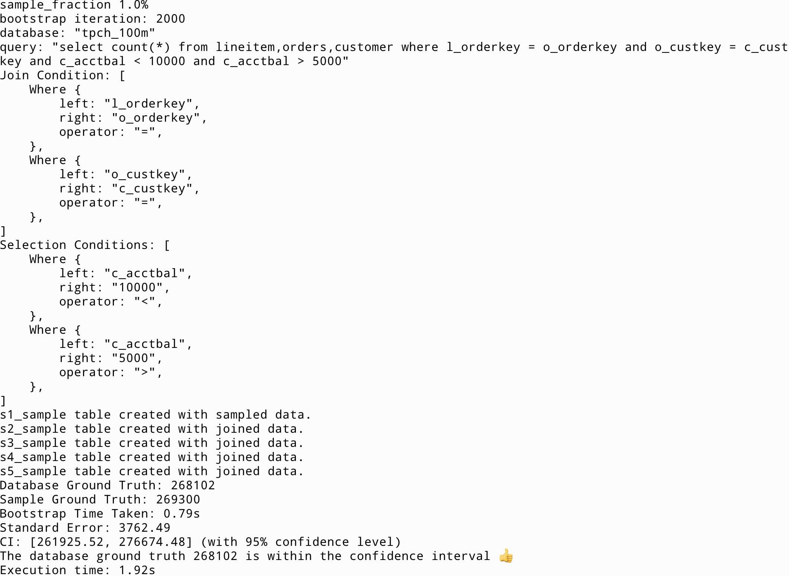

# aqprius
AQPrius: An online AQP engine enhanced with error assessment by bootstrap sampling

## How to Run the Code

Before running the code, make sure you have the following dependencies installed:

- SQLite
- Rust

To run the code, follow these steps:

1. Open your terminal and navigate to the `src` directory of the repository.
2. import TPC-H data into SQLite such as `tpch_100m.db`; type a query in the `query.txt`
3. To run a single time estimation, use the following command:

   ```
   cd src
   cargo run -- -d tpch_100m.db -s 1 -b 2000
   ```

   Here's the explanation of the command-line arguments:

   - `-d`: Specifies the name of the SQLite database.
   - `-s`: Specifies the sample ratio.
   - `-b`: Specifies the bootstrap size or number.


Runtime Demo

## Contributors

YSU Data Lab:

- Sabin Maharjan
- Feng "George" Yu


